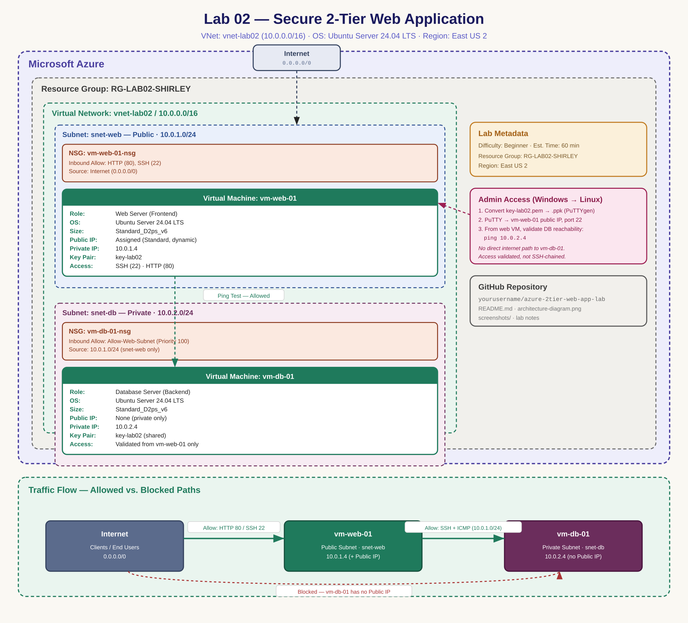

# Azure Secure Two-Tier IaaS Architecture


A hands-on Microsoft Azure infrastructure project demonstrating the deployment and security of a two-tier IaaS architecture.

The environment separates a public-facing Linux web server from a private back-end server using dedicated Azure subnets, Network Security Groups, SSH key authentication, and private IP networking. The back-end VM has no public IP address, reducing its exposure to direct internet traffic.


## Project Highlights

Built and secured a two-tier Microsoft Azure IaaS environment that separates a public-facing Linux web server from a private back-end server.

### Key Accomplishments

- Designed an Azure Virtual Network with separate web and database subnets to segment application traffic.
- Deployed and administered Ubuntu Linux virtual machines across public and private network tiers.
- Protected the back-end VM from direct internet exposure by deploying it without a public IP address.
- Configured Azure Network Security Group rules to permit traffic from the web subnet (`10.0.1.0/24`) to the private tier.
- Established SSH access from a Windows workstation to Azure Linux using PuTTY and SSH key authentication.
- Converted an Azure-generated PEM private key to PuTTY's PPK format using PuTTYgen.
- Validated private VNet connectivity between `vm-web-01` and `vm-db-01` using ICMP testing.
- Documented the architecture, security controls, network addressing, deployment process, and validation results.

### Technologies

`Microsoft Azure` · `Azure Virtual Machines` · `Azure Virtual Network` · `Network Security Groups` · `Ubuntu Linux` · `SSH` · `PuTTY` · `PuTTYgen` · `TCP/IP` · `CIDR`

--

## Table of Contents

- [Key Accomplishments](#key-Accommplishments)
- [Objective](#objective)
- [Architecture Diagram](#architecture-diagram)
- [Prerequisites](#prerequisites)
- [Lab Variables (Naming Convention)](#lab-variables-naming-convention)
- [Build Steps](#build-steps)
  - [Phase 1 — The Network Foundation](#phase-1--the-network-foundation)
  - [Phase 2 — Deploying the Web Server](#phase-2--deploying-the-web-server-front-end)
  - [Phase 3 — Deploying the Database Server](#phase-3--deploying-the-database-server-back-end)
  - [Phase 4 — Validating Connectivity](#phase-4--validating-connectivity-the-jump)
  - [Phase 5 — Configuring the Firewall (NSG)](#phase-5--configuring-the-firewall-nsg)
- [Troubleshooting](#troubleshooting)
- [Clean Up](#clean-up)
- [Skills Demonstrated](#skills-demonstrated)
- [Repository Structure](#repository-structure)
- [Project Context](#project-context)

---

## Objective

In this lab, I built a classic **IaaS architecture** on Azure consisting of a Virtual Network with two subnets:

- A **public subnet** hosting a Web Server, reachable from the internet.
- A **private subnet** hosting a Database Server, completely shielded from the internet.

The database VM is deployed without a public IP address, preventing direct inbound access from the internet. An NSG rule explicitly permits traffic originating from the web subnet (`10.0.1.0/24`), demonstrating subnet-based access control between application tiers.

---

## Architecture Diagram



**How to read this diagram:**

| Element | Meaning |
|---|---|
| `snet-web` (blue, public) | Public subnet — has a route to the internet; hosts `vm-web-01` |
| `snet-db` (purple, private) | Private subnet — no public IP assigned to any resource inside it; hosts `vm-db-01` |
| NSG boxes | Inbound rules attached to each tier controlling exactly what traffic is allowed in |
| Teal arrow | Allowed internal traffic (ping/ICMP, permitted by the `Allow-Web-Subnet` rule) from web tier to DB tier |
| Red dashed arrow | Blocked path — the internet has **no** route to `vm-db-01` because it has no public IP |

---

## Prerequisites

- [x] Active Azure Subscription
- [x] Completed Week 2 video modules
- [x] Terminal / SSH client installed locally (PuTTY, on Windows)

---

## Lab Variables (Naming Convention)

| Resource | Name | Value |
|---|---|---|
| Resource Group | `RG-LAB02-SHIRLEY` | — |
| Virtual Network | `vnet-lab02` | `10.0.0.0/16` |
| Subnet 1 (Public) | `snet-web` | `10.0.1.0/24` |
| Subnet 2 (Private) | `snet-db` | `10.0.2.0/24` |
| Web VM | `vm-web-01` | Public IP + `10.0.1.4` |
| Database VM | `vm-db-01` | No public IP · `10.0.2.4` |
| Key Pair | `key-lab02` | Shared across both VMs (`.pem`, converted to `.ppk` for PuTTY) |

---

## Build Steps

### Phase 1 — The Network Foundation

1. Search for **Virtual Networks** → **Create**.
2. **Basics:**
   - **Resource Group:** Create New → `RG-LAB02-SHIRLEY`
   - **Name:** `vnet-lab02`
   - **Region:** East US 2
3. **IP Addresses:**
   - **Address space:** `10.0.0.0/16`
   - **Subnet 1:** `snet-web` → `10.0.1.0/24`
   - **Subnet 2:** `snet-db` → `10.0.2.0/24`
4. **Review + create** → **Create**.

<!-- 📸 Screenshot: VNet address space + subnet configuration blade -->


---

### Phase 2 — Deploying the Web Server (Front End)

1. Search for **Virtual Machines** → **Create**.
2. **Basics:**
   - **Resource Group:** `RG-LAB02-SHIRLEY`
   - **Name:** `vm-web-01`
   - **Region:** East US 2
   - **Image:** Ubuntu Server 24.04 LTS
   - **Size:** `Standard_D2ps_v6`
   - **Key pair name:** `key-lab02`
   - **Public inbound ports:** Allow selected → **HTTP (80)** and **SSH (22)**
3. **Networking:**
   - **Subnet:** `snet-web`
   - **Public IP:** Create New (Standard)
4. **Review + create** → **Create**.
5. Download the private key (`.pem`) if prompted — **store it securely, it is not recoverable.**

<!-- 📸 Screenshot: vm-web-01 overview blade showing assigned public IP -->


---

### Phase 3 — Deploying the Database Server (Back End)

1. Create another **Virtual Machine**.
2. **Basics:**
   - **Resource Group:** `RG-LAB02-SHIRLEY`
   - **Name:** `vm-db-01`
   - **Region:** East US 2
   - **Image:** Ubuntu Server 24.04 LTS
   - **Size:** `Standard_D2ps_v6`
   - **Key pair name:** Use existing key stored in Azure → `key-lab02`
   - **Public inbound ports:** Allow selected → **SSH (22)** only
3. **Networking (critical step):**
   - **Virtual Network:** `vnet-lab02`
   - **Subnet:** change to **`snet-db`**
   - **Public IP:** **None** — this is a private server; it must not have a public IP.
4. **Review + create** → **Create**.

<!-- 📸 Screenshot: vm-db-01 networking tab confirming subnet=snet-db, Public IP=None -->


---

### Phase 4 — Validating Connectivity (The "Jump")

Because `vm-db-01` has no public IP, it cannot be reached directly from my local workstation. I first established an SSH connection to the public-facing `vm-web-01`, then used the web VM to validate private network connectivity to `vm-db-01`.

1. **Get the private IP of the DB server** — on the `vm-db-01` resource blade, note the private IP address (`10.0.2.4`).

2. **SSH into the web server** from the local Windows workstation.

   Azure generated the private SSH key as `key-lab02.pem`. Because PuTTY uses its native `.ppk` key format, I converted the PEM key using PuTTYgen:

   - Loaded `key-lab02.pem` into PuTTYgen
   - Converted and saved it as `key-lab02.ppk`
   - Configured PuTTY with the public IP of `vm-web-01`
   - Set `azureuser` as the SSH username
   - Selected `key-lab02.ppk` under SSH authentication credentials
   - Connected to `vm-web-01` over TCP port 22

3. **Test connectivity** from inside the web server:

   ```bash
   ping 10.0.2.4
   ```

   Successful replies confirm both servers are connected inside the same VNet. Press `Ctrl + C` to stop the ping.

<!-- 📸 Screenshot: terminal output of successful ping from vm-web-01 to 10.0.2.4 -->


---

### Phase 5 — Configuring the Firewall (NSG)

At this point `vm-db-01` still accepts any traffic on its subnet-level default rules. The goal is to ensure **only** the web subnet can talk to it.

1. Go to the **Networking** tab of `vm-db-01`.
2. Open its **Network Security Group** (auto-named something like `vm-db-01-nsg`).
3. **Inbound security rules** → **+ Add** → create the following rule:

| Setting | Value |
|---|---|
| Source | IP Addresses |
| Source IP addresses/CIDR ranges | `10.0.1.0/24` (the web subnet) |
| Source port ranges | `*` |
| Destination | Any |
| Service | Custom |
| Destination port ranges | `*` (or `3306`/`5432` if a real DB engine is installed) |
| Action | Allow |
| Priority | `100` |
| Name | `Allow-Web-Subnet` |

> **Note:** `vm-db-01` has no public IP, so it is not reachable from the internet regardless of NSG configuration. The default SSH inbound rule created during VM setup still shows `Source: Any` — that rule only matters if a public IP is later attached. The `Allow-Web-Subnet` rule is the one that explicitly documents and enforces least-privilege access: only the web subnet's internal traffic is permitted.

<!-- 📸 Screenshot: Allow-Web-Subnet inbound NSG rule configuration -->


---

## Troubleshooting

| Issue | Fix |
|---|---|
| Ping fails | Confirm `vm-db-01` was deployed into `snet-db` and that both VMs sit in the same VNet (`vnet-lab02`). |
| Can't SSH into `vm-db-01` | Expected — there is no public IP. SSH into `vm-web-01` first, then use it to validate connectivity to `vm-db-01`. (Copying the key onto the web server to SSH directly from there is an advanced follow-up topic.) |

---

## Clean Up

To avoid ongoing charges, delete the resource group once the lab is complete:

```bash
az group delete --name RG-LAB02-SHIRLEY --yes --no-wait
```

Or via the portal: **Resource Groups** → `RG-LAB02-SHIRLEY` → **Delete resource group**.

---

## Skills Demonstrated

- Designing and provisioning an Azure Virtual Network with segmented public/private subnets
- Applying **least-privilege network security** using Network Security Group (NSG) rules scoped by CIDR range
- Deploying and configuring Linux (Ubuntu 24.04 LTS) virtual machines via the Azure Portal
- Using a public-facing Linux VM as an administrative entry point for validating connectivity to a private application tier
- Validating internal network connectivity using standard Linux networking tools (`ping`)
- Documenting infrastructure with architecture diagrams and reproducible, naming-convention-driven build steps

---

## Repository Structure

```text
.
├── README.md                     # This file
├── architecture-diagram.png      # Architecture diagram (rendered)
└── screenshots/
    ├── 01-vnet-subnet-configuration.png
    ├── 02-web-server-overview.png
    ├── 03-private-database-server-overview.png
    ├── 04-web-to-database-connectivity.png
    └── 05-database-nsg-inbound-rules.png
```

---

## Project Context

This project was completed as part of a guided Azure infrastructure training exercise. I provisioned, configured, tested, troubleshot, and documented the environment independently as part of my cloud infrastructure portfolio.
